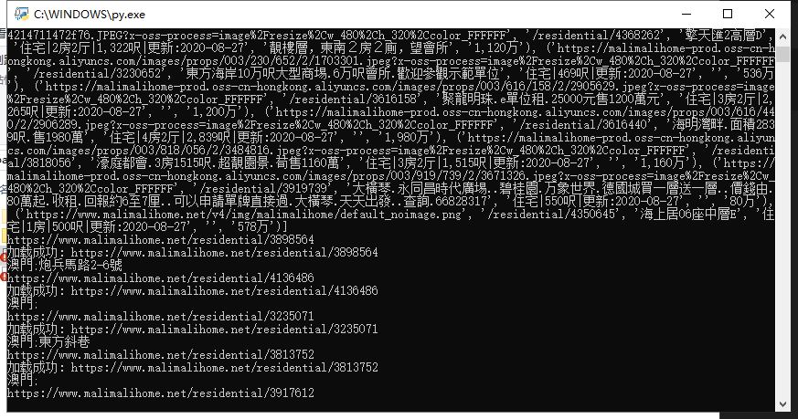
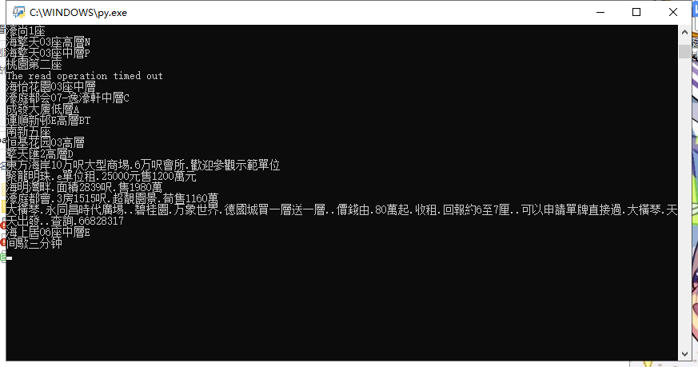
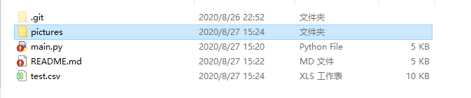

# python3爬虫爬取地产信息

爬虫实例：用python脚本爬取malimalihome.net上residential的[地产数据](https://www.malimalihome.net/residential)

简介：malimalihome.net/residential 上数据都放在网页源码中，比较好爬取也比较好理解，唯一不足的是很多项都没有具体地址信息，只精确到省份地址。1home.center中数据不明确，在网页上查看数据都是"Sorry No Results Found"，没有相关操作说明，我也只能暂且搁置。后两个openstreetmap和 msmap.dsat.gov.mo/zh ，不会用，地圖訊息讯息啥的不知道具体是啥，页面渲染啥的我能用pyspider得到，但还是不大了解要爬啥滴。

所以就写了个爬malimalihome上的房名，封面，价格，介绍，地址和其他的程序，程序每3分钟执行一次。

本程序相关的大部分内容都是笔者参照"python3网络爬虫开发实战"写的。

~~以上都是废话~~

## Table of Contents
1.  [环境搭建](#环境搭建)
2.  [爬取网页源码](#爬取网页源码)
3.  [保存图片](#保存图片)
4.  [保存为csv文件](#保存为csv文件)
5.  [运行效果](#运行效果)


## **环境搭建**

```python
import requests
import re
from urllib.parse import urlunsplit
import os
from urllib.request import urlopen
import csv
import time
```

需要用到这些库，应该用pip安装一下就可以了

## **爬取网页源码**

main.py包含内容

```python
def gethtml(url):
    headers={
    'User-Agent':'Mozilla/5.0 (Windows NT 10.0; Win64; x64; rv:79.0) Gecko/20100101 Firefox/79.0'
    }#firefox浏览器表头
    req=requests.get(url,headers=headers,timeout=10)
    print("加载成功:",url)
    return req.text

```

根据url获取网页源码，返回值为网页源码

```python
def get_onepage_html(be=0,st=30,l_before=[]):
    #url="https://httpbin.org/get"
    path='www.malimalihome.net'
    add='/residential'
    language="lang=zh_CN"
    begin="skipCount="+str(be)#时间由近到远，从第0项开始爬
    step="maxResultCount="+str(st)#一次爬取多少个结果，30个。可选值10，20，30
    query=language+"&"+begin+"&"+step
    scheme='https'
    #?lang=zh_CN&skipCount=0&maxResultCount=10 #简体中文，从第一项开始且一页显示10项
    url=urlunsplit([scheme,path+add,'',query,''])#目标网页链接,拼接
    html=gethtml(url)#得到网页源码
    html=re.sub('<b>|</b>|<span.*?>|</span>| |\\r|\\n|&nbsp|;','',html)#去掉这些东西，方便查找
    pattern=re.compile(
        'list-cover.*?(.*?)</a>.*?-c-type.*?>(.*?)</div>.*?-c-desc.*?>(.*?)<.*?-r-price.*?>(.*?)</div>'
        )#正则表达式
    #re.S#换行相关
    items=re.findall(pattern,html)
    print(items)
    add_l=[]#修改为list套dic的样式
    for i in items:
        dic={}
        dic["房名"]=i[2]
        add=i[1]
        url=urlunsplit([scheme,path+add,'','',''])
        print(url)
        html=gethtml(url)
        html=re.sub('\\r|\\n|\\t|&nbsp| ','',html)
        pattern=re.compile(
        '<span.*?glyphicon-map-marker.*?/span>(.*?)</div>'
        )
        s=re.findall(pattern,html)[0]
        dic["地址"]=s
        print(s)
        dic["照片"]=i[0]
        dic["描述"]=i[3]
        dic["其他"]=i[4]
        dic["价格"]=i[5]
        if dic in l_before:
            break
        add_l.append(dic)
    return add_l

```

利用正则表达式提取网页源码中的信息，返回为一个list信息列表

```python
#程序开始,爬取网页
#第一次爬取/初始化l
add_l=get_onepage_html()
for i in add_l:
    l.append(i)

```

第一次运行，返回初始列表l。
后续运行在while循环中，每次返回的是多于列表l的新传入的信息。

## **保存图片**

```python
save_pictures(l)

```

这里每项只保存了封面的图片，不需要保存的把main中所有用到save_pictures()给注释掉就好。

```python
save_picture(name=save_p,url=i['照片'])
```

save_picture()方法保存单张图片，输入为name（保存的路径），url（图片链接）

## **保存为csv文件**

```python
headers=['房名','地址','照片','描述','其他','价格']
#w覆盖,a追加,一般我用a+
with open('test.csv', 'w',newline='',encoding = 'gb18030')as f:
    f_csv = csv.DictWriter(f,headers)
    f_csv.writeheader()
    for i in l:
        try:
            f_csv.writerow(i)
        except Exception as e:
            print(e)
            pass

```

第一次运行方式为覆盖，写入标题表头和信息

```python
save_csv(add_l)

```

后续运行方式为追加，写入增加的内容

## **运行效果**

直接点击main.py运行

下载图片



中断间歇



生成文件


